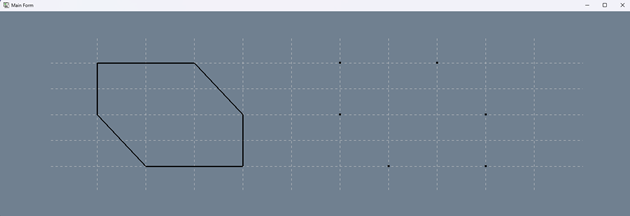
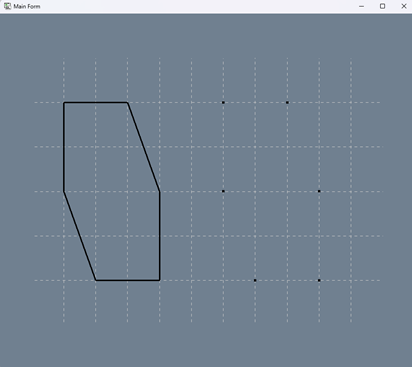

# Шаблон репозиторію для практичних робіт з M1.OpenGL.
## Системна Інформація
- Processor	AMD Ryzen 5 5600 6-Core Processor 3.50 GHz
- RAM	32.0 GB (31.9 GB usable)
- System type	64-bit operating system, x64-based processor
- Edition	Windows 11 Home Version 23H2
- IDE	Microsoft Visual Studio Enterprise 2022 (64-bit) version 17.11.2
## ПРАКТИЧНА РОБОТА 1.
### Виконання роботи
Для управління параметрами графічних примітивів було використано наступні команди (Додаток А):
̶	колір, glColor3d() рядок 12 у файлі Figure.cs;
̶	тип, glLineStipple(), glEnable()/glDisable(), рядок 27 у файлі MyForm.cs;
̶	товщина glLineWidth(), рядок 41 у файлі Figures.cs
Коректне відображення завдання під час змінення розмірів/положення вікна наведено у рис. 1.1 та 1.2
Розроблення підпрограм для виключення дублювання коду наведено у рядках 28 – 55 файлу Figures.cs
Застосування циклів для створення зображень наведено у рядках 15 – 24 файлу Figures.cs.
Використання ООП реалізовано за допомогою розроблення власних класів, які наведено у файлах Figures.cs, Додатку А.

Рисунок 1.1 – Тестування програми при зміні ширини вікна

Рисунок 1.2 – Тестування програми при зміні висоти вікна