# Шаблон репозиторію для практичних робіт з M1.OpenGL.
## Системна Інформація
- Processor	AMD Ryzen 5 5600 6-Core Processor 3.50 GHz
- RAM	32.0 GB (31.9 GB usable)
- System type	64-bit operating system, x64-based processor
- Edition	Windows 11 Home Version 23H2
- IDE	Microsoft Visual Studio Enterprise 2022 (64-bit) version 17.11.2
## ПРАКТИЧНА РОБОТА 1. Основні принципи роботи з OpenGL

### Мета роботи
За допомогою інструментальних засобів, зазначених викладачем, створити простий програмний проєкт із підтримкою бібліотеки OpenGL. Розробити програму із застосуванням команд OpenGL, яка встановлює анізотропну систему координат, створює та виводить варіант зображення на екран/у вікно з урахуванням заданих примітивів та координат x1, y1 та x2, y2 . Для рисування координатної сітки необхідно використовувати пунктирні лінії. Контур фігури, осі та координатну сітку зобразити лініями різної товщини. Для парних варіантів точки повинні мати квадратну форму, а для непарних – круглу

### Виконання роботи
Для управління параметрами графічних примітивів було використано наступні команди (Додаток А):
̶	колір, glColor3d() рядок 12 у файлі Figure.cs;
̶	тип, glLineStipple(), glEnable()/glDisable(), рядок 27 у файлі MyForm.cs;
̶	товщина glLineWidth(), рядок 41 у файлі Figures.cs
Коректне відображення завдання під час змінення розмірів/положення вікна наведено у рис. 1.1 та 1.2
Розроблення підпрограм для виключення дублювання коду наведено у рядках 28 – 55 файлу Figures.cs
Застосування циклів для створення зображень наведено у рядках 15 – 24 файлу Figures.cs.
Використання ООП реалізовано за допомогою розроблення власних класів, які наведено у файлах Figures.cs, Додатку А.

Рисунок 1.1 – Тестування програми при зміні ширини вікна

Рисунок 1.2 – Тестування програми при зміні висоти вікна

## ПРАКТИЧНА РОБОТА 2. Графічні примітиви OpenGL

### Мета роботи
Вивчити поняття теселяції і навчитися використовувати графічні примітиви OpenGL для створення поверхонь. Освоїти обробку подій клавіатури і маніпулятора «миша» для створення інтерактивних застосунків.

### Виконання роботи
У даній практичній роботі було розроблено застосунок з використанням бібліотеки OpenGL для відображення правильних багатокутника та можливості замощення області екрану користувачем. Програма реалізована з використанням команд OpenGL для керування примітивами, налаштування координатної системи, відображення фігур та взаємодії з користувачем.
Налаштування координатної системи: 
Використовуються функції glOrtho() та glViewport() для встановлення ізотропної системи координат, що дозволяє відображати багатокутники в центрі вікна незалежно від розмірів області рендерингу. Параметри масштабування визначаються розмірами фігури та кількістю плиток, які буде відображено на екрані.
Коректне відображення завдання під час змінення розмірів/положення вікна наведено у рис. 2.1 та 2.2
Відображення багатокутника: 
Для відображення правильного багатокутника використано примітиви GL_TRIANGLE_STRIP та GL_QUADS. Після старту програми у робочій області відображається одна плитка. Розмір плитки визначено згідно з варіантом, де сторона фігури дорівнює 4.25.
Реалізовано три режими відображення фігур:
•	Точковий режим (відображення лише вершин фігури) за допомогою примітиву GL_POINTS.
•	Контурний режим (відображення лише контуру фігури) за допомогою примітиву GL_LINE.
•	Режим із заливкою (заповнення кольором) за допомогою примітиву GL_TRIANGLE_STRIP та GL_QUADS.
Колірна схема: 
Для зафарбування фігур використано 4 кольори: сірий, червоний, синій та жовтий. Фарба накладається відповідно до положення багатокутників на екрані.

Рисунок 2.1 – Тестування програми при запуску

Рисунок 2.2 – Тестування програми при додаванні плиток

Рисунок 2.3 – Тестування програми при зміні ширини вікна

Рисунок 2.4 – Тестування програми при зміні висоти вікна

## ПРАКТИЧНА РОБОТА 3. Графік функції однієї змінної

### Мета роботи
Вивчити основні поняття і принципи перетворення координат для побудови двомірного графіка.

### Виконання роботи
Для реалізації завдання було розроблено програму, що будує графік функцій f_1 (x) та f_2 (x) на заданому інтервалі з можливістю масштабування і ручного налаштування осей. Зокрема, програма:
- Дозволяє користувачу задавати інтервал для осі 𝑋 і автоматично масштабує вісь 𝑌.
- Відображає осі координат, точки перетину функції з віссю абсцис та координатну сітку.
- Коректно відображає функцію f_2 (x) з урахуванням ліній розриву.

Рисунок 3.1 – Тестування роботи програми

Рисунок 3.2 – Тестування роботи програми, зміна параметрів і розміру вікна

Рисунок 3.3 – Тестування роботи програми, зміна функції і розміру вікна

## ПРАКТИЧНА РОБОТА 4.  Криві другого порядку

### Мета роботи
Вивчити оматематичні методи та засоби для реалізації графічних примітивів.

### Виконання роботи
Для реалізації завдання було розроблено програму, що малює еліпс або гіперболу на заданому інтервалі з можливістю вказання точок, що формують відрізок, в області графічного виведення програми за допомогою маніпулятора «миш».

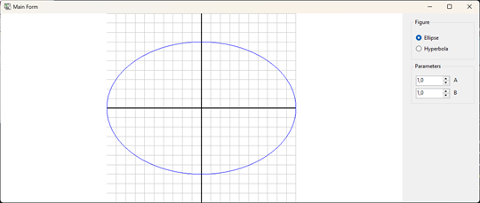

Рисунок 4.1 – Тестування роботи програми

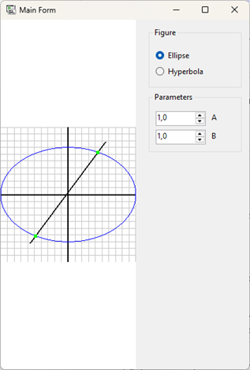

Рисунок 4.2 – Тестування роботи програми, зміна параметрів і розміру вікна

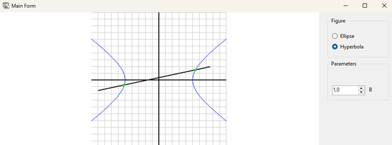

Рисунок 4.3 – Тестування роботи програми, зміна функції і розміру вікна

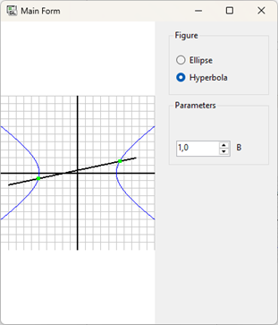

Рисунок 4.4 – Тестування роботи програми, зміна функції і розміру вікна

## ПРАКТИЧНА РОБОТА 5. Афінні перетворення у просторі
### Мета роботи
Навчитися працювати з тривимірними графічними примітивами OpenGL та застосовувати афінні перетворення для розміщення об’єктів у просторі.

### Виконання роботи
Для реалізації завдання було розроблено програму, має дві системи відображення трьох вимірного простору, де є сітка та лінії для показу осей. Також в просторі знаходяться три фігури по завданню, з можливістю вмикання/вимикання освітлення.

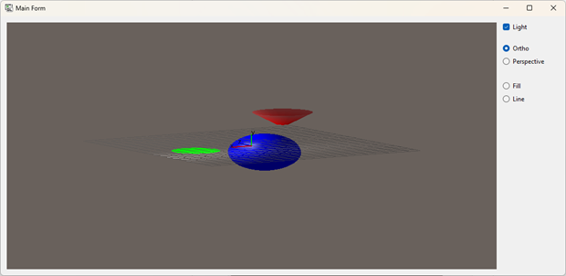

Рисунок 5.1 – Тестування роботи програми в ортогональному відображенні з заповненням фігур

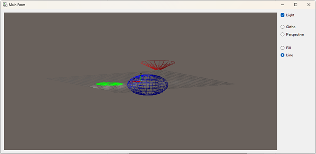

Рисунок 5.2 – Тестування роботи програми в ортогональному відображенні без заповнення фігур

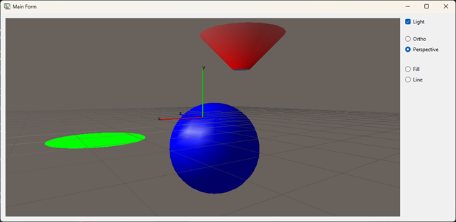

Рисунок 5.3 – Тестування роботи програми в перспективному відображенні з заповненням фігур

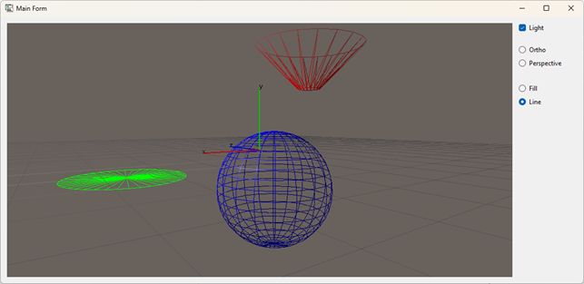

Рисунок 5.4 – Тестування роботи програми в перспективному відображенні без заповнення фігур

## ПРАКТИЧНА РОБОТА 6. Візуалізація задачі кінематики
### Мета роботи
Використовуючи інструментальні засоби, запропоновані викладачем, створити додаток для виведення на екран моделі маніпулятора за даною кінематичною схемою. Для управління моделлю та точкою спостереження необхідно використовувати клавіатуру та/або маніпулятор «миша», за допомогою яких змінюють значення параметрів, які відповідають руху, наприклад кути ϕ , θ , ψ , відстань S.

### Виконання роботи
В результаті виконання практичної роботи були повністю виконані елементи базового рівня та частково підвищеного рівня складності.

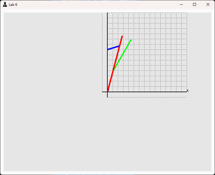

Рисунок 6.1 – Початковий стан кінематичної схеми після запуску програми

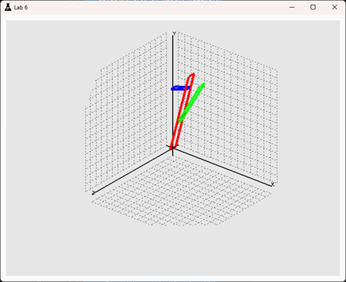

Рисунок 6.2 – Доопрацювання програми до тривимірної моделі

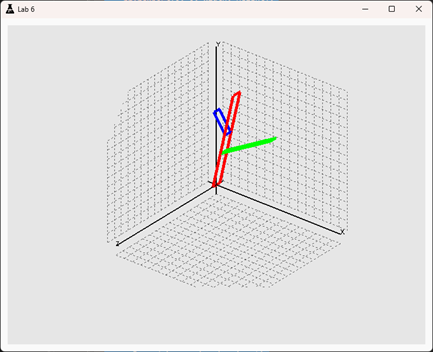

Рисунок 6.3 – Відображення координатної сітки X0Z та каркасу квадратичних об’єктів

## ПРАКТИЧНА РОБОТА 7. Екранна заставка з анімацією
### Мета роботи
Використовуючи засоби, указані викладачем, створити програму екранної заставки (ScreenSaver) з анімацією. Сюжет анімації обрати самостійно і погодити з викладачем.

### Виконання роботи
В результаті виконання практичної роботи були повністю виконані елементи базового рівня та підвищеного рівня складності.

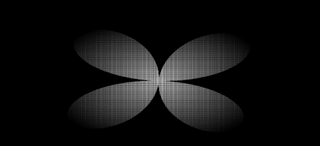

Рисунок 7.1 – Працююча анімація

Рисунок 7.2 – Вікно з налаштуваннями

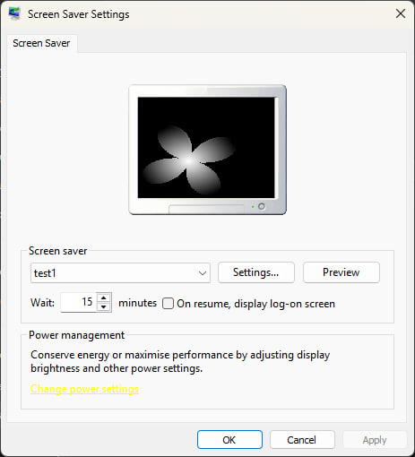

Рисунок 7.3 – Встановлена екранна заставка