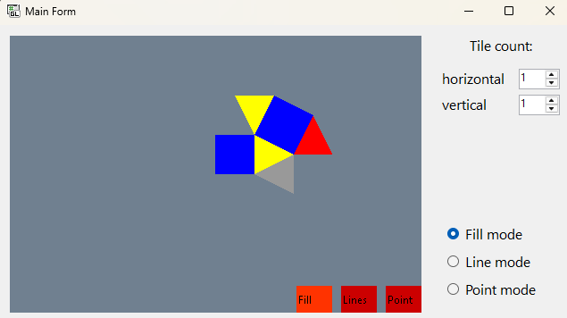
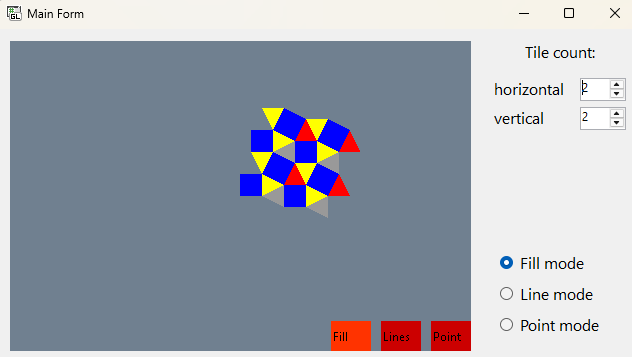
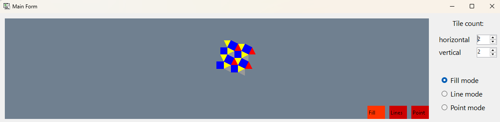
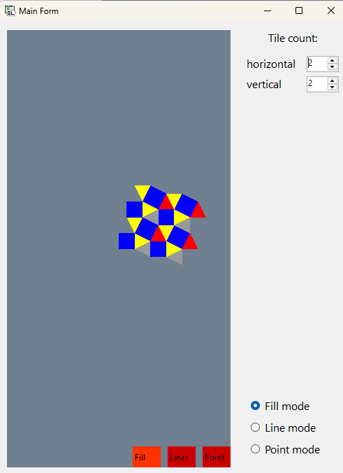
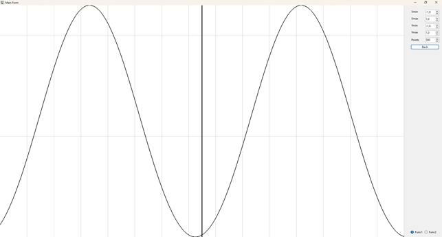
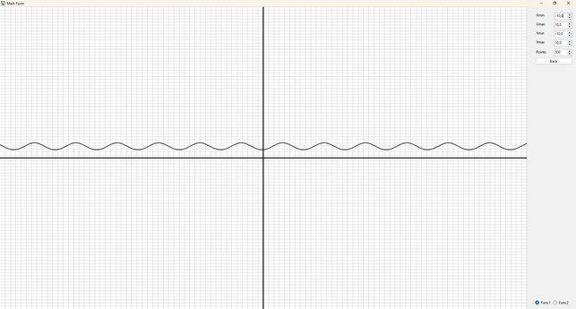
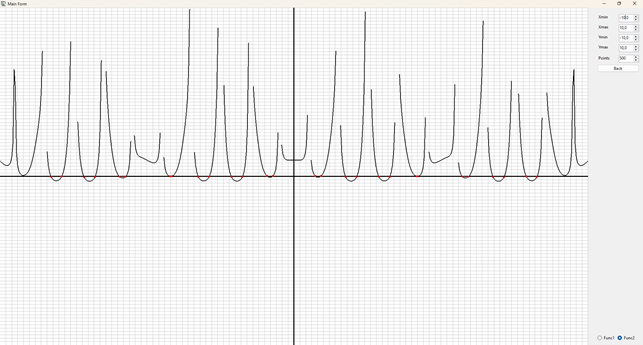

# Шаблон репозиторію для практичних робіт з M1.OpenGL.
## Системна Інформація
- Processor	AMD Ryzen 5 5600 6-Core Processor 3.50 GHz
- RAM	32.0 GB (31.9 GB usable)
- System type	64-bit operating system, x64-based processor
- Edition	Windows 11 Home Version 23H2
- IDE	Microsoft Visual Studio Enterprise 2022 (64-bit) version 17.11.2
## ПРАКТИЧНА РОБОТА 1.
### Виконання роботи
Для управління параметрами графічних примітивів було використано наступні команди (Додаток А):
̶	колір, glColor3d() рядок 12 у файлі Figure.cs;
̶	тип, glLineStipple(), glEnable()/glDisable(), рядок 27 у файлі MyForm.cs;
̶	товщина glLineWidth(), рядок 41 у файлі Figures.cs
Коректне відображення завдання під час змінення розмірів/положення вікна наведено у рис. 1.1 та 1.2
Розроблення підпрограм для виключення дублювання коду наведено у рядках 28 – 55 файлу Figures.cs
Застосування циклів для створення зображень наведено у рядках 15 – 24 файлу Figures.cs.
Використання ООП реалізовано за допомогою розроблення власних класів, які наведено у файлах Figures.cs, Додатку А.

Рисунок 1.1 – Тестування програми при зміні ширини вікна

Рисунок 1.2 – Тестування програми при зміні висоти вікна

## ПРАКТИЧНА РОБОТА 2.
### Виконання роботи
У даній практичній роботі було розроблено застосунок з використанням бібліотеки OpenGL для відображення правильних багатокутника та можливості замощення області екрану користувачем. Програма реалізована з використанням команд OpenGL для керування примітивами, налаштування координатної системи, відображення фігур та взаємодії з користувачем.
Налаштування координатної системи: 
Використовуються функції glOrtho() та glViewport() для встановлення ізотропної системи координат, що дозволяє відображати багатокутники в центрі вікна незалежно від розмірів області рендерингу. Параметри масштабування визначаються розмірами фігури та кількістю плиток, які буде відображено на екрані.
Коректне відображення завдання під час змінення розмірів/положення вікна наведено у рис. 2.1 та 2.2
Відображення багатокутника: 
Для відображення правильного багатокутника використано примітиви GL_TRIANGLE_STRIP та GL_QUADS. Після старту програми у робочій області відображається одна плитка. Розмір плитки визначено згідно з варіантом, де сторона фігури дорівнює 4.25.
Реалізовано три режими відображення фігур:
•	Точковий режим (відображення лише вершин фігури) за допомогою примітиву GL_POINTS.
•	Контурний режим (відображення лише контуру фігури) за допомогою примітиву GL_LINE.
•	Режим із заливкою (заповнення кольором) за допомогою примітиву GL_TRIANGLE_STRIP та GL_QUADS.
Колірна схема: 
Для зафарбування фігур використано 4 кольори: сірий, червоний, синій та жовтий. Фарба накладається відповідно до положення багатокутників на екрані.

Рисунок 2.1 – Тестування програми при запуску

Рисунок 2.2 – Тестування програми при додаванні плиток

Рисунок 2.3 – Тестування програми при зміні ширини вікна

Рисунок 2.4 – Тестування програми при зміні висоти вікна

## ПРАКТИЧНА РОБОТА 2.
### Виконання роботи
Для реалізації завдання було розроблено програму, що будує графік функцій f_1 (x) та f_2 (x) на заданому інтервалі з можливістю масштабування і ручного налаштування осей. Зокрема, програма:
- Дозволяє користувачу задавати інтервал для осі 𝑋 і автоматично масштабує вісь 𝑌.
- Відображає осі координат, точки перетину функції з віссю абсцис та координатну сітку.
- Коректно відображає функцію f_2 (x) з урахуванням ліній розриву.

Рисунок 3.1 – Тестування роботи програми

Рисунок 3.2 – Тестування роботи програми, зміна параметрів і розміру вікна

\

Рисунок 3.2 – Тестування роботи програми, зміна функції і розміру вікна

